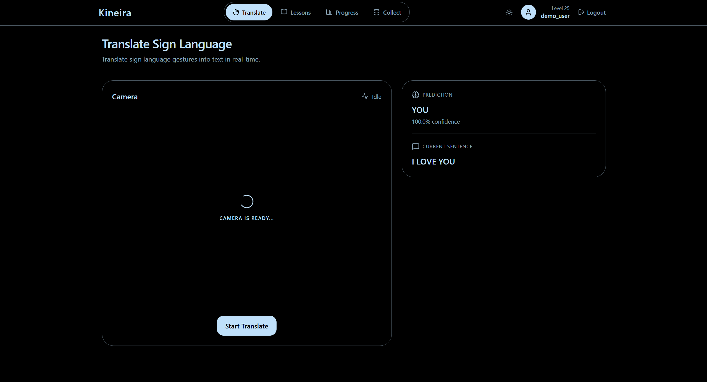
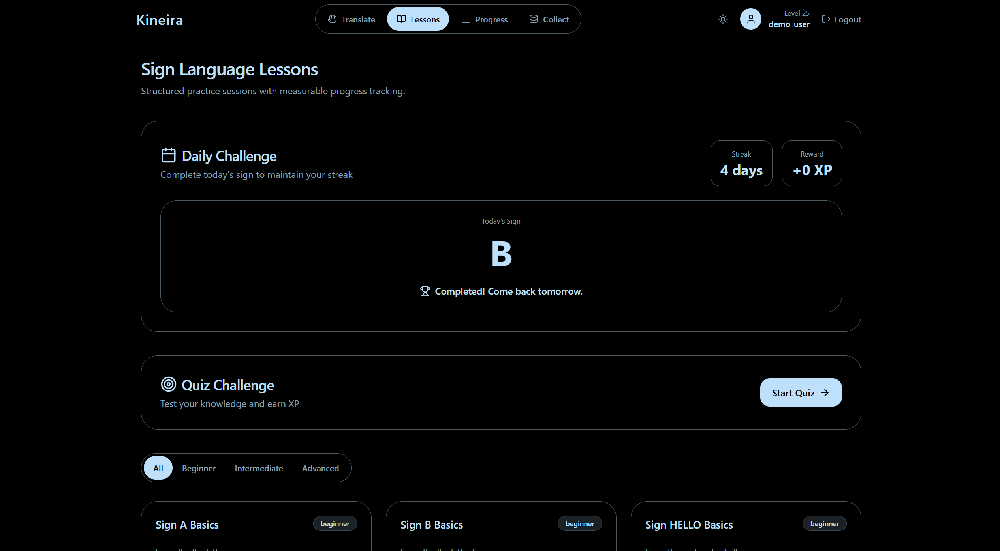
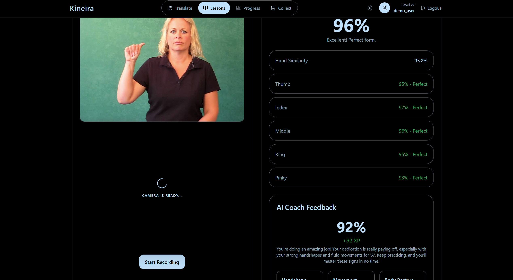
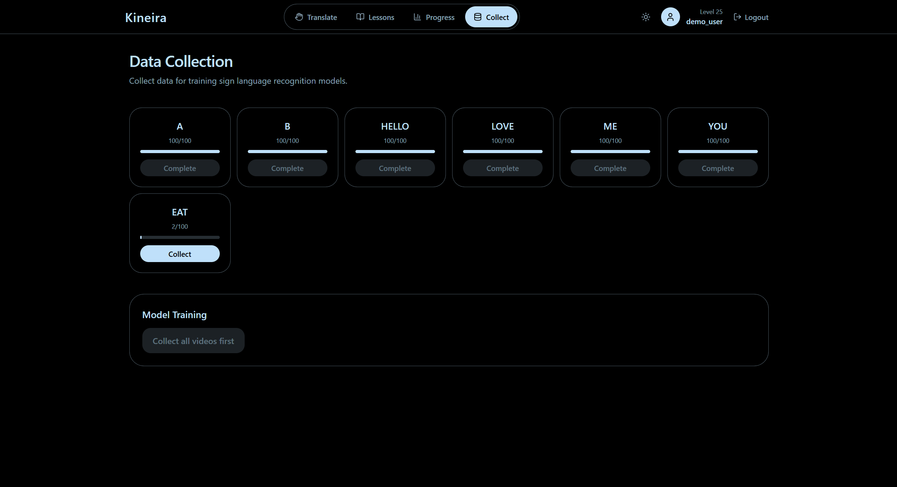
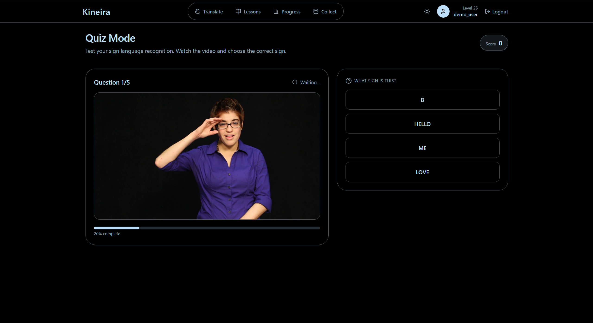
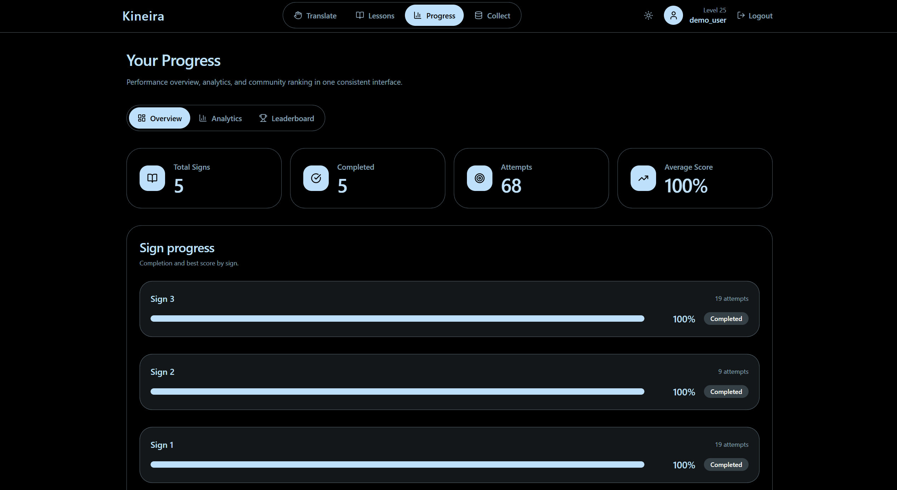
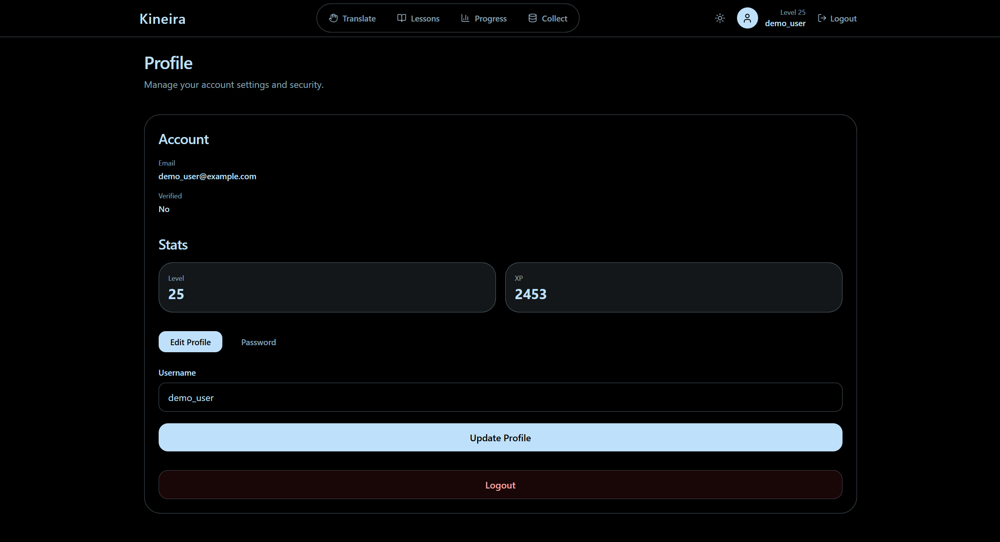
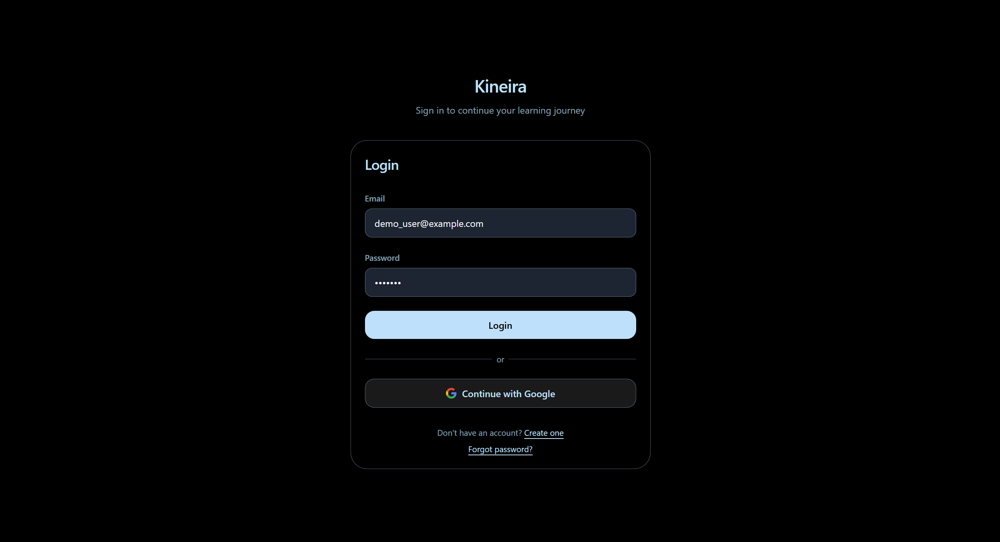
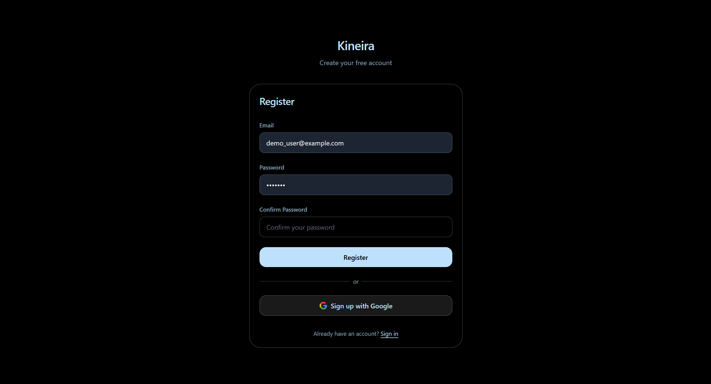

# Kineira

AI-powered sign language learning platform built with Next.js, FastAPI, MediaPipe Holistic, and TensorFlow.

Kineira helps users learn sign language through real-time gesture recognition, AI-assisted practice, structured lessons, quizzes, and progress tracking.

---

## Overview

Kineira is a full-stack EdTech application that combines computer vision and deep learning to recognize sign language gestures and provide detailed feedback during practice sessions.

The platform uses MediaPipe Holistic for landmark extraction and an LSTM neural network for gesture classification and scoring.

---

## Key Features

### Real-Time Sign Recognition

* Live sign language recognition using a webcam
* Continuous gesture prediction
* Confidence scoring for each prediction

### Interactive Learning

* Structured lessons organized by difficulty
* Guided practice sessions
* Instant feedback on user performance

### AI-Based Scoring

* Hand similarity analysis
* Pose similarity analysis
* Facial expression analysis
* Finger-level feedback and improvement suggestions

### Data Collection

* Guided recording workflow
* Automatic validation and retries
* Left-hand and right-hand data collection support

### Model Training

* Train gesture recognition models directly from the web interface
* Progress tracking during training
* Automatic preprocessing and augmentation

### User Engagement

* Progress dashboard
* Leaderboard system
* Daily challenges
* Quiz mode
* XP and streak tracking

### User Experience

* Responsive interface
* Light and dark themes
* Consistent design system

---

## Screenshots

### Translate



### Lessons



### Practice



### Data Collection



### Quiz



### Progress Dashboard



### Profile



### Sign In



### Sign Up



---

## System Architecture

### Frontend Pages

| Page      | Description                          |
| --------- | ------------------------------------ |
| Translate | Real-time sign recognition           |
| Lessons   | Browse learning content              |
| Practice  | Record and evaluate gestures         |
| Quiz      | Knowledge testing                    |
| Progress  | Statistics and analytics             |
| Collect   | Dataset creation                     |
| Profile   | User settings and account management |

---

## Data Flow

### Data Collection and Training

1. Select a sign from the Collect page.
2. Record gesture videos following the guided workflow.
3. Store extracted landmark data as NumPy arrays.
4. Preprocess and augment collected samples.
5. Train the LSTM model.
6. Save trained models and reference sequences.

Dataset location:

```text
datasets/MP_Data/{action}/{video_num}/*.npy
```

Model output location:

```text
assets/models/
```

### Translation Pipeline

1. Camera captures landmark data.
2. A sequence of 30 frames is generated.
3. The sequence is sent to the backend.
4. Data is normalized and scaled.
5. The LSTM model predicts the gesture.
6. Temporal smoothing improves stability.
7. Prediction and confidence score are returned.

### Practice and Scoring Pipeline

1. User performs a target gesture.
2. A 30-frame sequence is submitted.
3. Reference samples are loaded.
4. Similarity metrics are calculated.
5. Final score and feedback are generated.
6. Finger-level suggestions are returned.

---

## Technology Stack

### Frontend

* Next.js 14
* React
* TypeScript
* Tailwind CSS
* React Context API

### Backend

* FastAPI
* SQLAlchemy
* PostgreSQL
* NumPy
* Scikit-learn

### Machine Learning

* TensorFlow
* Keras
* MediaPipe Holistic
* LSTM Networks

---

## Project Structure

```text
Kineira
├── backend
│   ├── api
│   │   ├── routers
│   │   └── services
│   ├── assets
│   │   └── models
│   ├── datasets
│   ├── db
│   ├── ml
│   ├── config.py
│   └── main.py
│
├── frontend
│   ├── src
│   │   ├── components
│   │   ├── contexts
│   │   ├── lib
│   │   ├── pages
│   │   ├── services
│   │   ├── styles
│   │   └── types
│   ├── .env.local
│   └── package.json
│
└── README.md
```

---

## Installation

### Backend

```bash
cd backend

python -m venv venv

# Linux / macOS
source venv/bin/activate

# Windows
venv\Scripts\activate

pip install -r requirements.txt

python db/models.py
python db/seed.py

python main.py
```

Backend runs at:

```text
http://localhost:8000
```

### Frontend

```bash
cd frontend

npm install

npm run dev
```

Frontend runs at:

```text
http://localhost:3000
```

---

## Usage

### Collect Training Data

1. Open the Collect page.
2. Select a gesture.
3. Follow the recording instructions.
4. Complete all required recordings.

### Train the Model

1. Navigate to Collect.
2. Click Start Training.
3. Wait for training completion.

### Translate Signs

1. Open the Translate page.
2. Allow camera access.
3. Perform a gesture.
4. View prediction results in real time.

### Practice Lessons

1. Open a lesson.
2. Record a gesture attempt.
3. Review score and feedback.

### Take Quizzes

1. Open Quiz mode.
2. Answer gesture-related questions.
3. Earn XP and maintain streaks.

### Track Progress

1. Open the Progress page.
2. Review statistics and rankings.
3. Monitor learning history.

---

## API Endpoints

### Translation

```http
POST /translate
```

Submit a gesture sequence and receive a predicted sign and confidence score.

### Scoring

```http
POST /score
```

Evaluate a user gesture against a target sign.

### Data Collection

```http
GET    /data-collection/actions
GET    /data-collection/status
GET    /data-collection/next-video/{action}

POST   /data-collection/start/{action}/{video_num}
POST   /data-collection/frame-vector/{action}/{video_num}

DELETE /data-collection/video/{action}/{video_num}
```

### Training

```http
POST /training/start
GET  /training/status
POST /training/cancel
```

### Lessons

```http
GET /lessons
GET /lessons/{id}
```

### Progress

```http
POST /users/{id}/progress
```

Additional endpoints may be available for authentication, quizzes, statistics, daily challenges, and leaderboard functionality.

---

## Machine Learning Pipeline

### Dataset

* 100 videos per gesture
* 30 frames per video
* Augmented dataset generation

### Preprocessing

* Wrist-relative hand normalization
* Gaussian noise augmentation
* Time-warp augmentation
* Max-absolute scaling

### Model Architecture

```text
LSTM(64)
↓
Dropout(0.3)
↓
Dense(32)
↓
Dropout(0.3)
↓
Softmax
```

### Training Configuration

```text
Optimizer: Adam
Learning Rate: 0.0003
Clip Norm: 1.0
L2 Regularization: 0.001
Early Stopping Patience: 10
```

### Performance

Typical validation accuracy ranges from 95% to 100% when trained with clean and balanced datasets.

---

## Scoring System

```text
hand_similarity = cosine_similarity(user_hand, reference_hand)

pose_similarity = cosine_similarity(user_pose, reference_pose)

face_similarity = cosine_similarity(user_face, reference_face)

base_score =
    hand_similarity * 0.80 +
    pose_similarity * 0.15 +
    face_similarity * 0.05

final_score = base_score * penalty
```

Penalty is applied when the predicted gesture does not match the expected target gesture.

Additional finger-level similarity analysis is performed for:

* Thumb
* Index Finger
* Middle Finger
* Ring Finger
* Pinky Finger

---

## Configuration

Main configuration values are located in:

```text
backend/config.py
```

Example:

```python
ACTIONS = ["A", "B", "HELLO", "LOVE", "ME", "YOU", "EAT"]

VIDEOS_PER_ACTION = 100
FRAMES_PER_VIDEO = 30

N_HAND = 21
N_POSE = 23
N_FACE = 37

FEATURE_SIZE = 329

LSTM_EPOCHS = 2000
LSTM_BATCH_SIZE = 32

SEQUENCE_LENGTH = 30
```

## Acknowledgements

* MediaPipe
* TensorFlow
* FastAPI
* Next.js
* PostgreSQL
* Tailwind CSS
